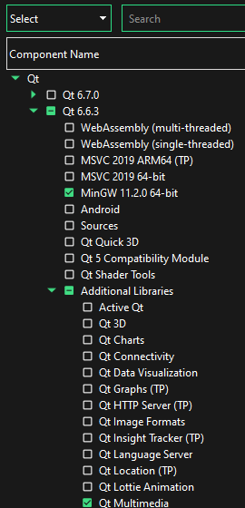
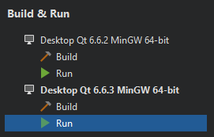
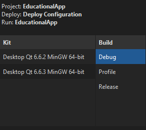

# Education App - Revolutionary

## Features
A basic platformer game to teach you about the revolutionary war as you play along! The goal is to progress through the level and learn by reading the surrounding text, your goal is to eventually reach the door. Once you touch the door, you will be given a question and you must choose the correct answer to proceed. After the correct answer is chosen, the next level will be loaded and you may either start it, learn about the level, or view your past levels!

## Building
make sure Qt Multimedia is installed, you can check by attempting to compile or to install it you can:  
1. open Qt Maintenance Tool
2. sign in
3. add components
4. expand Qt
5. go to your Qt version and under Additional Libraries it should say "Qt Multimedia"
6. if it is not there go to the next sub-version higher and install the compiler along with it

7. let it install then quit
8. restart Qt Creator
9. to build with the new kit, click the Projects button and under the **Build & Run** section, it should be greyed out, click to enable it

10. now select the new kit in your build profile

11. now build normally

## Authors

Kevin, Markus, Brenden, Walker, Zak